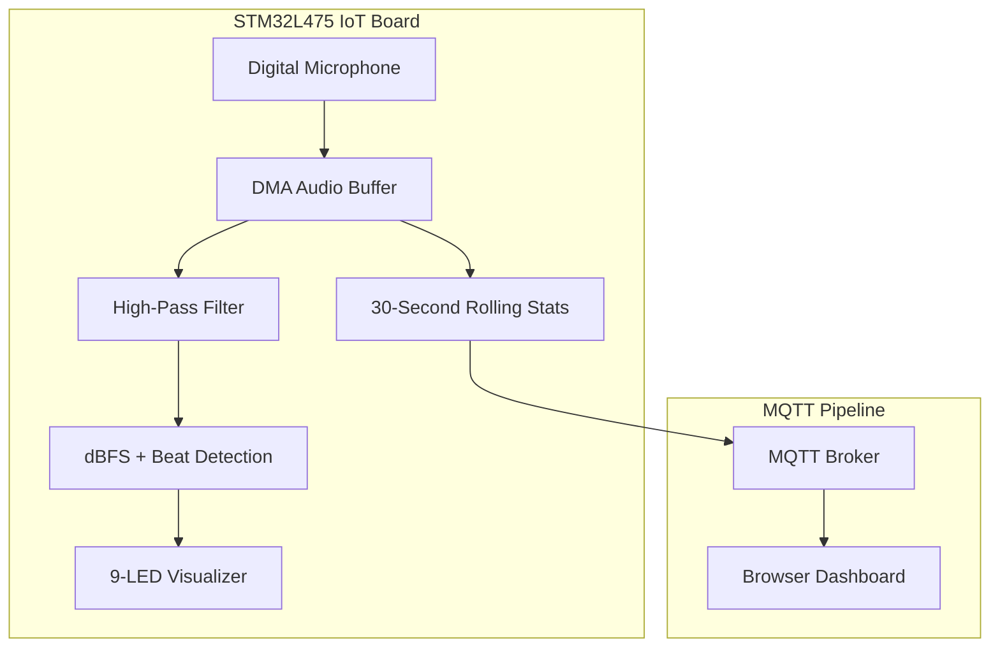

# micd

> `micd(8)` — the microphone daemon. Listens to the room, blinks LEDs, speaks MQTT.

**micd** is an embedded audio-reactive LED visualizer built on Mbed OS for the
STM32L475 Discovery IoT board. It samples ambient audio from the onboard digital
microphone, filters and analyzes the signal in real time, drives a 9-LED
visualizer, and publishes rolling sound-level telemetry over MQTT for a browser
dashboard.

## FEATURES

- Real-time embedded audio processing with DMA microphone callbacks.
- Digital filtering, RMS/dBFS calculation, envelope tracking, and simple onset
  detection for bass, mid, and high-frequency events.
- Concurrent firmware design using Mbed threads, event queues, interrupts, and
  low-power waits.
- Wi-Fi and MQTT integration from a constrained device to a local broker.
- A lightweight web dashboard that subscribes to live telemetry over MQTT
  WebSockets.

## HISTORY

This was our final project for CSC385 (Microprocessor Systems) where we had to demonstrate our knowledge in course topics such as Internet of Things (IoT), embedded computing, scheduling for real-time systems, optimizing power consumption and programming with sensors on lightweight, low power processors


## ARCHITECTURE



The firmware publishes sound statistics to `sound/volume` as JSON:

```json
{
  "avg_decibel": -31.4,
  "min_decibel": -60.0,
  "max_decibel": -10.3
}
```

## HARDWARE

- STM32L475 Discovery IoT board with the onboard MP34DT01 digital microphone.
- 9 LEDs connected to pins `D0` through `D8`.
- Wi-Fi network reachable by both the board and the machine running Mosquitto.

## INSTALL

### 1. Configure Wi-Fi

Update `mbed_app.json` with local credentials before building:

```json
{
  "target_overrides": {
    "*": {
      "nsapi.default-wifi-ssid": "\"YOUR_WIFI_SSID\"",
      "nsapi.default-wifi-password": "\"YOUR_WIFI_PASSWORD\""
    }
  }
}
```

`main.cpp` calls `wifi->connect()`, so the firmware reads these values from the
Mbed configuration instead of hard-coding private credentials in source.

### 2. Start the MQTT broker

Install Mosquitto:

```bash
brew install mosquitto
```

Run it with the included config:

```bash
mosquitto -c mosquitto.conf
```

The config opens:

- `1883` for firmware MQTT traffic.
- `9001` for browser MQTT over WebSockets.

### 3. Configure the broker IP

Set the broker IP to the local IP address of the machine running Mosquitto. The
firmware defaults to `192.168.2.138`, but it can be overridden at build time:

```bash
mbed compile -t GCC_ARM -m DISCO_L475VG_IOT01A --profile mbed-os/tools/profiles/release.json -D MQTT_BROKER_IP=\"192.168.2.138\"
```

If MQTT cannot connect, confirm that the board and broker are on the same
network and that the machine firewall allows ports `1883` and `9001`.

### 4. Patch the MQTT client

This is an important step, we had to patch the original Mbed MQTT library because it targets an older Mbed OS Socket API. Replace the library's `MQTTClient.h` with the version in `Patch/MQTTClient.h`, which uses `send` and `recv` for Mbed OS 6 compatibility.

### 5. Open the dashboard

Open `web/index.html`, then update the `host` constant if your broker
WebSocket URL is different:

```js
const host = "ws://192.168.2.138:9001";
```
